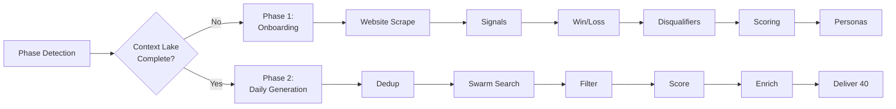
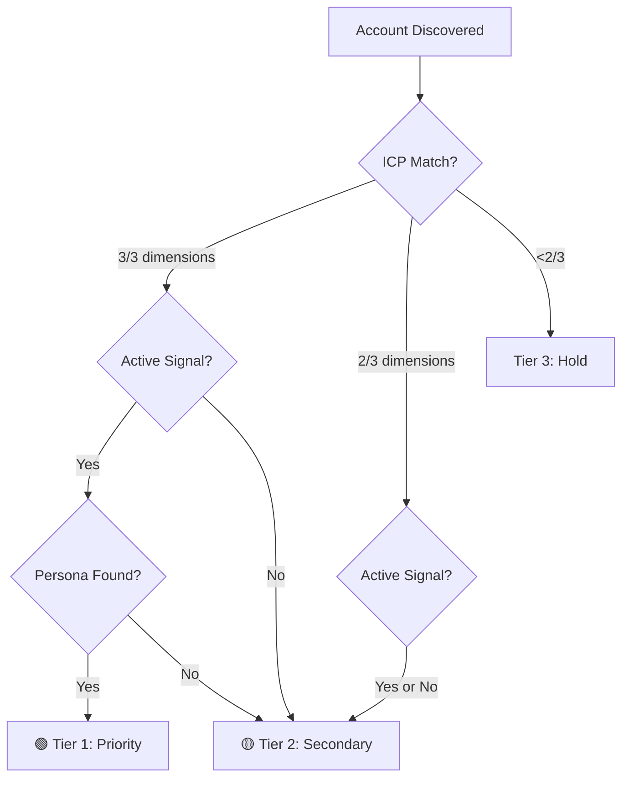

# Sushidata GTM Intelligence — Sales Onboarding & Daily Lead Generation

> Read `SETTINGS.md` at the plugin root for **BASE_URL**, **Tenant**, and **Dataspace**.

**Schedule:** Monday–Friday, 9:00 AM (customer local time)
**Target output:** 40 net-new qualified accounts per day with associated buyer persona contacts

Two phases:

1. **Onboarding** (Phase 1) — one-time setup capturing business context, ICP, signals, win/loss intelligence, disqualification criteria, scoring model, and persona discovery template.
2. **Daily Lead Generation** (Phase 2) — discovers 40 net-new qualified accounts with buyer contacts on every run.

---

## Dependencies & Tools

| Capability | Source |
|---|---|
| Context lake CRUD | `sushi-research` SKILL → endpoints `/context/`, `/query/`, `/swarm/deploy/`, `/swarm/status/` |
| Company & contact discovery order | `sushi-research/finding-companies-and-contacts.md` |
| Email discovery & verification | `provider-playbooks/fullenrich.md` → `fullenrich_start_enrichment`, `fullenrich_get_enrichment`, `fullenrich_search_people` |
| LinkedIn campaign activation | `provider-playbooks/heyreach.md` → `heyreach_list_campaigns`, `heyreach_add_to_campaign` |
| CRM sync | `provider-playbooks/hubspot.md` |
| Web scraping | `provider-playbooks/apify.md` + exposed Apify MCP tools |
| Buying signal detection | `sushi-signals` skill (LinkedIn signals: job changes, pain posts, hiring) |
| Email validation | `sushi-research/scripts/validate-emails.py` |
| LinkedIn name validation | `sushi-research/scripts/validate-linkedin-names.py` |
| Outreach drafting | `sushi-research/jobs/writing-outreach.md` |
| Session persistence | `sushi-save` skill |

---

## Elicitation Forms — Mandatory for All User Input

**CRITICAL:** All onboarding questions MUST be collected via the `askQuestions` elicitation tool — never as plain-text questions in the chat. This provides a professional, interactive form UI with selectable options, multi-select, and freeform fields.

### Rules

1. **Every question to the user must go through `askQuestions`** — no exceptions during onboarding.
2. **Use `options` with predefined choices** wherever the answer set is known or can be inferred.
3. **Use `multiSelect: true`** for questions where multiple answers are valid (e.g., round stages, signal types, industries).
4. **Always include a skip/decline option** (e.g., "Skip this signal", "None", "Not relevant") so users aren't forced into answering.
5. **Use `allowFreeformInput: true`** (default) when users may want to add custom answers beyond the options.
6. **Set `allowFreeformInput: false`** only for strict yes/no or fixed-choice questions.
7. **Group related questions in a single `askQuestions` call** — batch up to 5 related questions per form to minimize back-and-forth.
8. **Use `message` field for context** — provide brief explanatory markdown below each question header.
9. **Use `recommended: true`** on the most common/expected option to guide users.

### Form Patterns by Step

Below are the exact elicitation form structures to use for each onboarding step. Render these via `askQuestions` — do NOT convert them to blockquote text.

---

## Generative UI — Output Presentation Standards

All *output* (non-interactive) content uses rich markdown rendering. Follow these patterns for presenting results:

### Workflow Visualization

On first invocation, render the pipeline overview:



### Onboarding Progress Tracker

Display and update after each onboarding step completes:

```
## 🍣 Sushidata Onboarding

| Step | Status | Description |
|:---:|:---:|---|
| 1 | ✅ | Business Context Extracted |
| 2 | ⏳ | Signal Configuration |
| 3 | ⬜ | Win/Loss Intelligence |
| 4 | ⬜ | Disqualification Criteria |
| 5 | ⬜ | Scoring Model |
| 6 | ⬜ | Persona Template & HeyReach |
```

Use ✅ (complete), ⏳ (in progress), ⬜ (pending). Update after each step.

### Business Context Presentation (Step 1 output)

Present extracted context using structured cards:

```
---

### 🏢 Company Description

> [2–4 sentence value prop extracted from the website]

---

### 🎯 Ideal Customer Profile

| Dimension | Value |
|---|---|
| **Industry** | [verticals] |
| **Size** | [headcount / revenue] |
| **Model** | [B2B / PLG / Enterprise] |
| **Geography** | [regions] |
| **Tech Environment** | [platforms, integrations] |

---

### 👤 Buyer Personas

| # | Title | Department | Seniority | Why They Care |
|---|---|---|---|---|
| 1 | [title] | [dept] | [level] | [reason] |
| 2 | [title] | [dept] | [level] | [reason] |
| 3 | [title] | [dept] | [level] | [reason] |

---

> ✅ Confirm  ·  ✏️ Edit  ·  ➕ Add
```

### Signal Configuration Cards (Step 2 output)

Present each signal as a visual card:

```
---

#### 📡 Signal: `fundraising`

| Field | Your Configuration |
|---|---|
| **Status** | 🟢 Active |
| **Round Stages** | Series A, B, C+ |
| **Minimum Amount** | $5M |
| **Relevant Investors** | a16z, Sequoia |

---
```

Use 🟢 Active / 🔴 Inactive / ⚪ Not Configured for status.

### Daily Run Dashboard (Phase 2 header)

Open every daily run with a status dashboard. Render a `mermaid` pie chart showing Pipeline Breakdown (Tier 1, Tier 2, Disqualified, Deduped counts), then display:

```
## 🍣 Daily Lead Generation — [Date]

| Metric | Value |
|---|---|
| **Exclusion List Size** | 342 domains |
| **Last Run** | May 27, 2026 |
| **Accounts Searched** | 60 |
| **Disqualified** | 14 |
| **Delivered** | 40 |
| **Signals Triggered** | hiring_signal (23), fundraising (12), brand_move (5) |
```

The pie chart uses this structure:
````mermaid
pie title "Pipeline Breakdown"
    "Tier 1 (Priority)" : 18
    "Tier 2 (Secondary)" : 22
    "Disqualified" : 14
    "Deduped" : 6
````

### Account Cards (Phase 2 output delivery)

Present each account as a rich card instead of a flat table row:

```
---

### 🏢 Acme Corp — Tier 1

| | |
|---|---|
| **Domain** | acme.com |
| **LinkedIn** | [linkedin.com/company/acme](https://linkedin.com/company/acme) |
| **Industry** | B2B SaaS · DevTools |
| **Headcount** | 250 |
| **Location** | San Francisco, CA |
| **ICP Segment** | Mid-market DevTools |

#### 📡 Signals Detected

| Signal | Date | Summary | Source |
|---|---|---|---|
| 🟢 `hiring_signal` | May 20 | Posted "Head of Revenue Ops" with keywords: pipeline automation, forecasting | [LinkedIn Jobs](url) |
| 🟢 `fundraising` | May 15 | Series B — $28M led by Sequoia | [TechCrunch](url) |

#### 👤 Buyer Personas Found

| Priority | Name | Title | Email | LinkedIn | Tenure |
|---|---|---|---|---|---|
| ⭐ 1st | Jane Smith | VP Revenue Operations | j.smith@acme.com ✅ | [Profile](url) | 8 months |
| 2nd | Mike Chen | Director Sales Ops | m.chen@acme.com ✅ | [Profile](url) | 2 years |

> **Recommended first contact:** Jane Smith — new in role (8mo), directly responsible for the pain this product solves, economic buyer.

---
```

Use ⭐ for recommended first contact. Use ✅ next to verified emails.

### Scoring Visualization

When presenting the scoring model during onboarding or showing tier breakdowns:



### Progress Updates During Execution

During long-running Phase 2 steps, show progress:

```
⏳ **Swarm Search** — 10 workers deployed, polling for results...
████████░░ 80% — 48/60 accounts discovered

⏳ **Persona Discovery** — enriching contacts...
██████░░░░ 60% — 24/40 accounts enriched
```

### Next Steps (Post-Delivery)

**Always use an elicitation form for next steps** — never present a plain-text menu. See the `askQuestions` form in Phase 2 Step 7. This ensures the user can select actions with a single click rather than typing.

### Formatting Rules

1. **All user input via elicitation forms** — never ask questions as plain text in chat. Use `askQuestions` with options, multi-select, and freeform as appropriate.
2. **Always use the progress tracker** during onboarding — update it after every step.
3. **Always open Phase 2 with the dashboard** — show metrics at a glance.
4. **Account cards over flat tables** — each account gets its own card with signals + personas grouped visually.
5. **Mermaid for workflows** — use flowcharts for process visualization, pie charts for breakdowns.
6. **Status indicators are mandatory** — 🟢/🟡/🔴 for tiers, ✅/⬜/⏳ for progress, ⭐ for recommended actions.
7. **Horizontal rules (`---`) between cards** — visual separation between accounts.
8. **Elicitation forms for all decisions** — next steps, confirmations, and configuration choices go through `askQuestions`, not blockquote prompts.
9. **Email verification badges** — ✅ verified, ⚠️ unverified, ❌ invalid — always shown inline.
10. **Collapsible detail for schemas** — wrap the Context Lake Schema Reference in a `<details>` block to keep it out of the way unless needed.
11. **Never dump raw JSON to the user** — always render structured data as tables or cards.

---

## Phase Detection

On every invocation:

1. `POST {BASE_URL}query/` with `{ "query": "context.company_description context.icp context.buyer_personas context.signals context.disqualification_criteria" }`
2. If the context lake returns valid values for **all five keys** → skip to **Phase 2**.
3. If any are missing → run **Phase 1** starting from the first missing step.

**Never ask the user which phase to run.** Detection is automatic.

---

# PHASE 1: ONBOARDING

> Runs once on first execution. If business context already exists in the context lake, skip to Phase 2.

---

## Step 1 — Website Scrape & Business Context Extraction

**Elicitation Form — Website URL:**

```
askQuestions([
  {
    header: "Company website",
    question: "What is your company's website URL?",
    message: "I'll scrape it to auto-generate your business context — ICP, buyer personas, and company description — so you don't have to fill everything out manually."
  }
])
```

Once provided, scrape using WebSearch + WebFetch:

- Homepage
- `/about` or `/about-us`
- `/product`, `/solutions`, or `/platform`
- `/customers` or `/case-studies` (if present)
- `/pricing` (if present)

If WebFetch returns a JavaScript shell with no content, escalate to Browser Rendering via Apify (see `provider-playbooks/apify.md`).

From the scraped content, extract three fields:

### `COMPANY_DESCRIPTION`
2–4 sentences: who they are, what they sell, how they help customers. Focus on value proposition, not marketing fluff. Extract from homepage hero, about page, tagline copy.

### `IDEAL_CUSTOMER_PROFILE (ICP)`
Structured description including:
- Company size (headcount ranges, revenue tiers)
- Industry verticals
- Business model (B2B, B2C, PLG, enterprise, etc.)
- Geographic focus
- Technology environment (from case studies, integrations, partner pages)

Extract from customer logos, case studies, pricing tiers, and "built for" language.

### `BUYER_PERSONAS`
List of most likely buyers. For each persona:
- Job title(s) and seniority level
- Department / function
- Relevant responsibilities tied to the product
- Why they would care about this solution

Extract from testimonials, case study quotes, sales page language, "who is this for" copy.

Present the extracted context visually (see Generative UI output section), then collect confirmation:

**Elicitation Form — Context Review:**

```
askQuestions([
  {
    header: "Company description",
    question: "Is this company description accurate?",
    message: "[Insert the extracted 2–4 sentence description]",
    options: [
      { label: "Yes, looks good", recommended: true },
      { label: "Needs edits" }
    ],
    allowFreeformInput: true
  },
  {
    header: "ICP accuracy",
    question: "Does this ICP match your actual target market?",
    message: "[Insert the extracted ICP dimensions as a formatted list]",
    options: [
      { label: "Yes, accurate", recommended: true },
      { label: "Needs edits" }
    ],
    allowFreeformInput: true
  },
  {
    header: "Buyer personas",
    question: "Are these the right buyer personas?",
    message: "[Insert the extracted personas as a formatted list]",
    options: [
      { label: "Yes, confirmed", recommended: true },
      { label: "Needs edits" },
      { label: "Missing personas — I'll add details" }
    ],
    allowFreeformInput: true
  }
])
```

If the user selects "Needs edits" or provides freeform corrections, incorporate changes before saving.

After confirmation, save to the context lake:

```json
POST {BASE_URL}context/
{
  "serverId": "26",
  "content": "ONBOARDING — company_description: [value] | icp: [structured JSON] | buyer_personas: [structured JSON array]",
  "messageId": "msg-<timestamp>",
  "userId": "claude-user",
  "username": "Claude",
  "createdDate": "<new Date().toISOString() — exact UTC timestamp, never local time or an approximation>",
  "channelId": "claude-session",
  "threadId": "<cowork-session-id>"
}
```

---

## Step 2 — Signal Configuration

Signals are collected via a sequence of elicitation forms — one per signal type. Each form explains the signal, offers relevant options, and allows freeform customization.

**Elicitation Form — Fundraising Signal:**

```
askQuestions([
  {
    header: "Fundraising signal",
    question: "Which fundraising round stages are worth targeting?",
    message: "This signal fires when a company closes a funding round. Sources: TechCrunch, press releases, Crunchbase.",
    options: [
      { label: "Seed" },
      { label: "Series A", recommended: true },
      { label: "Series B", recommended: true },
      { label: "Series C+" },
      { label: "Skip this signal" }
    ],
    multiSelect: true
  },
  {
    header: "Minimum funding amount",
    question: "Is there a minimum funding amount that makes a company worth targeting?",
    message: "Leave blank if any amount is fine.",
    options: [
      { label: "$1M+" },
      { label: "$5M+" },
      { label: "$10M+" },
      { label: "$25M+" },
      { label: "No minimum" }
    ]
  },
  {
    header: "Relevant investors",
    question: "Do specific investors in the round matter to you?",
    message: "If certain VCs/investors signal a better fit, list them. Otherwise skip.",
    options: [
      { label: "No, any investor is fine", recommended: true },
      { label: "Yes — I'll list them below" }
    ],
    allowFreeformInput: true
  }
])
```

**Elicitation Form — Hiring Signal:**

```
askQuestions([
  {
    header: "Hiring signal",
    question: "What job titles signal a company is investing in your problem space?",
    message: "This signal fires when a company posts a job matching your keywords. Sources: LinkedIn Jobs, Bumble intent.\n\nExamples: 'Head of Revenue Operations', 'AI Infrastructure Engineer', 'VP Data'",
    allowFreeformInput: true
  },
  {
    header: "Hiring keywords",
    question: "What keywords in a job posting indicate fit?",
    message: "These are words/phrases that appear in job descriptions of companies you'd want to sell to.\n\nExamples: 'meeting intelligence', 'voice AI', 'data pipeline', 'revenue operations'",
    allowFreeformInput: true
  },
  {
    header: "Skip hiring signal",
    question: "Is this signal relevant to your business?",
    options: [
      { label: "Yes, activate this signal", recommended: true },
      { label: "Skip this signal" }
    ],
    allowFreeformInput: false
  }
])
```

**Elicitation Form — Brand Move Signal:**

```
askQuestions([
  {
    header: "Brand move signal",
    question: "Which brand activities signal a company is in motion?",
    message: "This signal fires on trade press appearances: rebrands, agency hires, campaign launches, product drops, exec announcements.\n\nSources: Marketing Dive, LBB, Ad Age, vertical trade publications.",
    options: [
      { label: "New product launch" },
      { label: "Rebrand" },
      { label: "New CMO/CRO/VP hire" },
      { label: "Major campaign launch" },
      { label: "Agency hire" },
      { label: "Skip this signal" }
    ],
    multiSelect: true
  },
  {
    header: "Trade publications",
    question: "Any specific trade publications we should monitor for your industry?",
    message: "We already cover Marketing Dive, LBB, and Ad Age. Add any vertical-specific publications here.",
    options: [
      { label: "Default publications are fine", recommended: true },
      { label: "I'll add specific publications below" }
    ],
    allowFreeformInput: true
  }
])
```

**Elicitation Form — LinkedIn Reactor Signal:**

```
askQuestions([
  {
    header: "LinkedIn activity types",
    question: "Which LinkedIn activity types are useful buying signals?",
    message: "This signal fires when a LinkedIn post matches a configured type. We monitor posts from people at target companies.",
    options: [
      { label: "Competitor Post — engaging with/posting about a competitor" },
      { label: "Sentiment Post — expressing frustration or pain relevant to your product" },
      { label: "AI Art Gen Post — exploring AI-generated creative content" },
      { label: "Custom Post — I'll describe below" },
      { label: "Skip this signal" }
    ],
    multiSelect: true
  },
  {
    header: "Competitor names",
    question: "Which competitors should we monitor for Competitor Post signals?",
    message: "List competitor names whose mentions indicate an opportunity for you.",
    allowFreeformInput: true
  },
  {
    header: "Pain keywords",
    question: "What pain points or complaints indicate a fit for Sentiment Post signals?",
    message: "Describe the frustrations or problems that suggest someone needs your solution.",
    allowFreeformInput: true
  }
])
```

**Elicitation Form — Custom Signals:**

```
askQuestions([
  {
    header: "Additional signals",
    question: "Are there any signals not covered above that your team looks out for?",
    message: "These could be any real-world events that indicate buying intent or fit.",
    options: [
      { label: "G2/Capterra reviews" },
      { label: "GitHub issues or activity" },
      { label: "Reddit/community threads" },
      { label: "Tech stack detection (job postings or vendor pages)" },
      { label: "Conference attendance" },
      { label: "Executive changes" },
      { label: "None — the standard signals are sufficient", recommended: true }
    ],
    multiSelect: true,
    allowFreeformInput: true
  }
])
```

Save all confirmed signals using the GENISYS signal payload structure:

```json
POST {BASE_URL}context/
{
  "serverId": "26",
  "content": "ONBOARDING — signals: [JSON array per schema below]",
  "messageId": "msg-<timestamp>",
  "userId": "claude-user",
  "username": "Claude",
  "createdDate": "<new Date().toISOString() — exact UTC timestamp, never local time or an approximation>",
  "channelId": "claude-session",
  "threadId": "<cowork-session-id>"
}
```

Each signal entry follows:
```json
{
  "signal_trigger": "fundraising | hiring_signal | brand_move | li_reactor",
  "is_active": true,
  "configuration": {
    "relevant_rounds": [],
    "min_amount_usd": null,
    "relevant_investors": [],
    "matched_job_titles": [],
    "matched_keywords": [],
    "relevant_event_types": [],
    "monitored_publications": [],
    "active_post_types": [],
    "competitor_names": [],
    "pain_keywords": []
  },
  "relevance_notes": ""
}
```

---

## Step 3 — Win/Loss Intelligence

**Automated path:** Check if the customer has Closed Won / Closed Lost domain lists. If yes (≥20 won + ≥10 lost), invoke the `niche-signal-discovery` skill to surface differential signals automatically. This produces a scored report with statistical lift analysis — far superior to self-reported patterns.

**Elicitation Form — Win/Loss Data Availability:**

```
askQuestions([
  {
    header: "Win/loss data",
    question: "Do you have Closed Won and Closed Lost domain lists we can analyze?",
    message: "If you have ≥20 won + ≥10 lost domains, I can run automated differential signal analysis (much more accurate than self-reported patterns). Otherwise, I'll ask a few questions manually.",
    options: [
      { label: "Yes — I'll provide domain lists", recommended: true },
      { label: "No — ask me manually" },
      { label: "Skip this step" }
    ],
    allowFreeformInput: false
  }
])
```

If automated path is selected, invoke `niche-signal-discovery` skill with the provided lists.

**Manual path — Elicitation Form — Win Patterns:**

```
askQuestions([
  {
    header: "Won company traits",
    question: "When you've closed deals, what did those companies typically have in common?",
    message: "Think about: industry, size, tech stack, trigger event, org structure, buying process.",
    allowFreeformInput: true
  },
  {
    header: "Champion profile",
    question: "What does a champion at a won account typically look like?",
    message: "Title, seniority, attitude, how they engaged with your team.",
    allowFreeformInput: true
  },
  {
    header: "Accelerating events",
    question: "Was there a specific signal or event that accelerated those deals?",
    message: "Examples: budget cycle, leadership change, failed competitor implementation, compliance deadline.",
    allowFreeformInput: true
  }
])
```

**Manual path — Elicitation Form — Loss Patterns:**

```
askQuestions([
  {
    header: "Deal killers",
    question: "What are the most common reasons deals fall apart or go quiet?",
    message: "Think about: budget, timing, internal politics, lack of urgency, competitor choice.",
    allowFreeformInput: true
  },
  {
    header: "Time wasters",
    question: "Are there types of companies that waste your team's time but rarely convert?",
    message: "Describe the pattern — industry, size, behavior during sales process.",
    allowFreeformInput: true
  },
  {
    header: "Wrong personas",
    question: "Are there titles or personas you've been targeting that turn out to have no buying authority?",
    message: "List titles that seem relevant but can't actually sign off or champion internally.",
    allowFreeformInput: true
  }
])
```

Save to context lake as `context.win_patterns` and `context.loss_patterns`. Use these to inform scoring weights in Step 5.

---

## Step 4 — Disqualification Criteria

Collect hard disqualifiers via elicitation form. Each category is a separate question so users can skip irrelevant ones.

**Elicitation Form — Disqualification Rules:**

```
askQuestions([
  {
    header: "Industry exclusions",
    question: "Are there industries that are definitively NOT a fit?",
    message: "These companies will be automatically excluded before any outreach. Only list hard blockers, not soft preferences.",
    options: [
      { label: "Government / public sector" },
      { label: "Healthcare / pharma" },
      { label: "Consumer retail (no B2B motion)" },
      { label: "Education / non-profit" },
      { label: "Financial services" },
      { label: "No industry exclusions", recommended: true }
    ],
    multiSelect: true,
    allowFreeformInput: true
  },
  {
    header: "Size exclusions",
    question: "Are there headcount or revenue thresholds that disqualify a company?",
    message: "Set minimum and/or maximum. Companies outside this range will be excluded.",
    options: [
      { label: "Too small: fewer than 50 employees" },
      { label: "Too small: fewer than 100 employees" },
      { label: "Too small: fewer than 200 employees" },
      { label: "Too large: over 1,000 employees" },
      { label: "Too large: over 5,000 employees" },
      { label: "Too large: over 10,000 employees" },
      { label: "No size exclusions" }
    ],
    multiSelect: true,
    allowFreeformInput: true
  },
  {
    header: "Business model exclusions",
    question: "Are certain business models excluded?",
    options: [
      { label: "Consumer-only (B2C with no B2B)" },
      { label: "Direct-to-consumer (D2C)" },
      { label: "Non-commercial / non-profit" },
      { label: "Marketplace / platform only" },
      { label: "No model exclusions", recommended: true }
    ],
    multiSelect: true,
    allowFreeformInput: true
  },
  {
    header: "Geographic exclusions",
    question: "Are there countries or regions you do NOT sell into?",
    options: [
      { label: "Outside North America" },
      { label: "Outside US only" },
      { label: "Outside English-speaking countries" },
      { label: "Specific countries (I'll list below)" },
      { label: "No geographic exclusions — we sell globally", recommended: true }
    ],
    allowFreeformInput: true
  },
  {
    header: "Competitive exclusions",
    question: "Should we exclude companies already using a directly competitive solution?",
    message: "List competitors whose existing customers are impossible to win (not just hard to win).",
    options: [
      { label: "Yes — I'll list competitors below" },
      { label: "No — competitor customers are still fair game", recommended: true }
    ],
    allowFreeformInput: true
  }
])
```

Save as `context.disqualification_criteria[]`:

```json
{
  "category": "",
  "rule": "",
  "rationale": "",
  "hard_block": true
}
```

---

## Step 5 — Account Scoring & Prioritization Model

Using confirmed ICP, signals, win patterns, and disqualifiers, define the scoring tiers:

| Tier | Label | Criteria |
|---|---|---|
| **1** | Strong Fit — Priority Outreach | ICP match on industry + size + model AND ≥1 active signal AND passes all disqualifiers AND persona confirmed |
| **2** | Moderate Fit — Secondary Outreach | ICP match on 2/3 dimensions AND passes all disqualifiers AND ≥1 persona present |
| **3** | Weak Fit — Hold/Nurture | Partial ICP match OR no signal detected; passes disqualifiers |

Disqualified accounts are excluded from all tiers and logged with the triggering rule.

For each scored account, also run ICP segmentation to identify which ICP sub-segment they represent so outreach can be personalized at the segment level.

Save scoring model to context lake as `context.scoring_model`.

Present the scoring model visually using the **Scoring Visualization** Mermaid flowchart (see Generative UI section), then confirm via elicitation form:

**Elicitation Form — Scoring Confirmation:**

```
askQuestions([
  {
    header: "Scoring model",
    question: "Does this scoring framework match your prioritization?",
    message: "**Tier 1 (Priority):** Full ICP match + active signal + persona confirmed\n**Tier 2 (Secondary):** Partial ICP match + passes disqualifiers\n**Tier 3 (Hold):** Weak match, no signal — nurture only",
    options: [
      { label: "Yes, this works", recommended: true },
      { label: "I'd adjust the criteria" }
    ],
    allowFreeformInput: true
  }
])
```

---

## Step 6 — Persona Discovery Template & HeyReach Configuration

**Elicitation Form — Persona Priority & HeyReach:**

```
askQuestions([
  {
    header: "Persona priority order",
    question: "What order should we prioritize buyer personas for outreach?",
    message: "When multiple contacts are found at an account, we'll recommend the highest-priority persona first.",
    options: [
      { label: "Economic buyer → Champion → Technical evaluator", recommended: true, description: "Decision-maker first, then internal advocate, then gatekeeper" },
      { label: "Champion → Economic buyer → Technical evaluator", description: "Internal advocate first, then escalate to decision-maker" },
      { label: "Technical evaluator → Champion → Economic buyer", description: "Bottom-up: prove value with evaluator first" }
    ],
    allowFreeformInput: false
  },
  {
    header: "HeyReach lookback window",
    question: "How many days should we look back for HeyReach deduplication?",
    message: "Contacts messaged or connected within this window are excluded from new runs to avoid double-touching.",
    options: [
      { label: "30 days" },
      { label: "60 days" },
      { label: "90 days", recommended: true },
      { label: "120 days" },
      { label: "180 days" }
    ],
    allowFreeformInput: false
  },
  {
    header: "Contact enrichment depth",
    question: "What contact information do you need for outreach?",
    options: [
      { label: "Email only", description: "Business email verified via FullEnrich" },
      { label: "Email + LinkedIn", recommended: true, description: "Email + LinkedIn profile URL" },
      { label: "Email + LinkedIn + Phone", description: "Full enrichment (may cost more credits)" }
    ],
    allowFreeformInput: false
  }
])
```

For each persona match, the daily run will extract:
- Full name, current title, LinkedIn profile URL
- Business email (via FullEnrich — see `provider-playbooks/fullenrich.md`)
- Phone (if selected above)
- Time in current role (tenure signal)
- Recent activity signals (posts, job changes, publications)

Save persona template and HeyReach lookback window to context lake.

Flag accounts where no persona match is found — these may be disqualified or held pending further enrichment.

Tell the customer:

> "🎉 **Onboarding complete.** Your context lake now has everything needed to run daily lead generation."

Then display the completed progress tracker (all ✅) and a summary card:

```
---

## ✅ Onboarding Complete

| Component | Status | Summary |
|---|---|---|
| Company Context | ✅ Saved | [company_description snippet] |
| ICP | ✅ Saved | [industry] · [size] · [model] |
| Signals | ✅ Saved | [N] active signals configured |
| Win/Loss | ✅ Saved | [N] win patterns, [N] loss patterns |
| Disqualifiers | ✅ Saved | [N] hard-block rules |
| Scoring Model | ✅ Saved | Tier 1/2/3 framework active |
| Persona Template | ✅ Saved | [N] buyer personas, HeyReach [N]-day window |

> **Next:** Say "run my daily leads" or "generate leads" to trigger your first batch of 40 accounts.

---
```

---

# PHASE 2: DAILY LEAD GENERATION

> Runs Monday–Friday on each invocation after onboarding is complete.
> **Target:** 40 net-new qualified accounts with buyer persona contacts.

**Pre-condition:** Phase 1 must be complete — context lake must contain valid values for `context.company_description`, `context.icp`, `context.buyer_personas`, `context.signals`, and `context.disqualification_criteria`.

---

## Step 1 — Context Restore & Deduplication

Load from context lake via `/query/`:
- `context.icp`, `context.buyer_personas`, `context.signals`, `context.disqualification_criteria`, `context.scoring_model`
- `context.delivered_accounts[]` — all previously delivered domains
- `context.disqualified_accounts[]` — all previously excluded domains
- `context.heyreach_events[]` — contacts touched via HeyReach in the configured lookback window

**HeyReach Deduplication:**
Query `context.heyreach_events[]` for any contacts where `event_trigger` is `message_sent`, `connection_request_sent`, or `connection_request_accepted` within the lookback window (default 90 days). Contacts and companies in an active HeyReach sequence must be excluded.

Check for:
```json
{
  "event_trigger": "message_sent | connection_request_sent | connection_request_accepted",
  "event_date": "",
  "campaign": { "name": "" },
  "contact": { "linkedin": "", "company": "" }
}
```

Build a combined exclusion list of:
- All previously delivered company domains
- All disqualified company domains
- All LinkedIn URLs / company domains with HeyReach activity in the lookback window

Use `niche-signal-discovery/scripts/dedupe_utils.py` for apex-domain matching (handles subdomain/parent relationships like amsynergy.nikon.com → nikon.com). Log exclusion list size and last run date to context lake.

---

## Step 2 — Swarm Search for Net-New Accounts

Deploy a Sushidata research swarm via `POST {BASE_URL}swarm/deploy/`:

```json
{
  "query": "Find 60 companies matching this ICP: [load from context.icp]. Active signals to look for: [load from context.signals where is_active=true]. Exclude these domains: [exclusion list]. For each company return: name, domain, LinkedIn URL, industry, headcount, location, and which signals were detected with evidence URLs.",
  "swarmSize": 10
}
```

Over-provision at 60 to account for ~33% disqualification falloff.

**Source routing by active signal:**
- `fundraising` → TechCrunch, press releases, Crunchbase
- `hiring_signal` → LinkedIn Jobs, Bumble intent
- `brand_move` → Marketing Dive, LBB, Ad Age, configured trade publications
- `li_reactor` → LinkedIn post monitoring filtered by configured `post_types`, competitor names, pain keywords

Follow the discovery order from `finding-companies-and-contacts.md`: **companies first, then people.**

Poll `{BASE_URL}swarm/status/` every 30s. Show progress using the **Progress Updates** format (progress bar with worker count and accounts discovered). When `allDone: true` or at 5-minute timeout, synthesize results directly from the `output` fields of completed workers gathered during polling.

---

## Step 3 — Disqualification Filtering

Run every discovered account against `context.disqualification_criteria[]`. Any account triggering a `hard_block: true` rule is immediately excluded and logged:

```json
POST {BASE_URL}context/
{
  "serverId": "26",
  "content": "DISQUALIFIED: [domain] — rule: [category: rule] — date: [today]",
  "messageId": "msg-<timestamp>",
  "userId": "claude-user",
  "username": "Claude",
  "createdDate": "<new Date().toISOString() — exact UTC timestamp, never local time or an approximation>",
  "channelId": "claude-session",
  "threadId": "<cowork-session-id>"
}
```

---

## Step 4 — Scoring & Segmentation

Score each passing account using the Tier 1/2/3 model from `context.scoring_model`. Segment by ICP sub-segment. Rank Tier 1 first, then Tier 2, until 40 accounts are confirmed.

If fewer than 40 pass:
- Expand search radius (loosen one non-critical ICP dimension) and re-search
- Log the shortfall and reason to context lake
- Do **NOT** pad with Tier 3 without explicit customer authorization

---

## Step 5 — Persona Discovery

For each of the 40 confirmed accounts, find buyer personas using the provider escalation order from `finding-companies-and-contacts.md`:

1. `fullenrich_search_people current_company_domains=[{"value":"{domain}"}]` — structured contact discovery
2. Filter results by titles/departments/seniority from `context.buyer_personas`
3. Spot-check FullEnrich confidence scores — **mandatory** before any outbound
4. If FullEnrich returns <2 contacts, supplement with WebSearch + Sushidata swarm for role discovery

Prioritize: **economic buyer → champion → technical evaluator.**

Run `sushi-research/scripts/validate-emails.py` on the final enriched set to flag domain mismatches.
Run `sushi-research/scripts/validate-linkedin-names.py` on LinkedIn URLs to confirm name consistency.

**Approval gate:** Before scaling enrichment calls beyond the first 10 accounts, show cost estimate and get explicit approval (per `sushi-research` policy).

---

## Step 6 — Context Lake Write-Back

Save the full run results:

```json
POST {BASE_URL}context/
{
  "serverId": "26",
  "content": "DAILY RUN [date] — run_log: {accounts_discovered: X, accounts_disqualified: Y, accounts_delivered: 40, signals_triggered: [...], shortfall_flag: false, dedup_exclusions_count: Z}. delivered_accounts: [JSON array with company_domain, company_name, company_linkedin, tier, segment, signals_detected, personas, delivered_date]",
  "messageId": "msg-<timestamp>",
  "userId": "claude-user",
  "username": "Claude",
  "createdDate": "<new Date().toISOString() — exact UTC timestamp, never local time or an approximation>",
  "channelId": "claude-session",
  "threadId": "<cowork-session-id>"
}
```

---

## Step 7 — Output Delivery

Open with the **Daily Run Dashboard** (see Generative UI section) showing metrics at a glance — accounts searched, disqualified, delivered, signal breakdown, and a pie chart.

Present each of the 40 accounts using the **Account Card** format. Group by tier (Tier 1 first, then Tier 2). Each card includes:

- Company header with tier badge (🟢 Tier 1 / 🟡 Tier 2)
- Company metadata table (domain, LinkedIn, industry, headcount, location, ICP segment)
- Signals Detected table with dates, summaries, and source URLs
- Buyer Personas table with priority order, verification badges, and tenure
- Recommended first contact callout with rationale in a blockquote

After all 40 cards, present the **Next Steps** via elicitation form:

**Elicitation Form — Next Steps:**

```
askQuestions([
  {
    header: "Next steps",
    question: "What would you like to do with these leads?",
    message: "Select one or more actions to take on today's delivered accounts.",
    options: [
      { label: "Activate in HeyReach", description: "Push contacts into a LinkedIn outreach campaign" },
      { label: "Write personalized outreach", description: "Draft per-account sequences using signals as hooks" },
      { label: "Sync to HubSpot", description: "Create contacts + deals in your CRM" },
      { label: "Deep-dive a specific account", description: "Run a full research swarm on one company" },
      { label: "Save to context lake", description: "Persist this session for future reference", recommended: true },
      { label: "Done for now", description: "No further action needed today" }
    ],
    multiSelect: true
  }
])
```

Formatting requirements:
- Horizontal rules (`---`) between each account card
- ✅ badge on verified emails, ⚠️ on unverified, ❌ on invalid
- ⭐ on the recommended first contact row
- Source URLs must be clickable markdown links
- Never dump raw JSON — all data rendered as visual tables/cards

---

<details>
<summary><strong>Context Lake Schema Reference</strong> (click to expand)</summary>

```json
{
  "context": {
    "company_description": "",
    "icp": {
      "industry": [],
      "size": {},
      "model": "",
      "geo": [],
      "tech": []
    },
    "buyer_personas": [
      { "title": "", "department": "", "seniority": "", "why_they_care": "" }
    ],
    "signals": [
      {
        "signal_trigger": "fundraising | hiring_signal | brand_move | li_reactor",
        "is_active": true,
        "configuration": {
          "relevant_rounds": [],
          "min_amount_usd": null,
          "relevant_investors": [],
          "matched_job_titles": [],
          "matched_keywords": [],
          "relevant_event_types": [],
          "monitored_publications": [],
          "active_post_types": [],
          "competitor_names": [],
          "pain_keywords": []
        },
        "relevance_notes": ""
      }
    ],
    "win_patterns": {
      "company_traits": [],
      "champion_traits": [],
      "trigger_events": []
    },
    "loss_patterns": {
      "common_reasons": [],
      "time_wasting_profiles": [],
      "wrong_personas": []
    },
    "disqualification_criteria": [
      { "category": "", "rule": "", "rationale": "", "hard_block": true }
    ],
    "scoring_model": {
      "tier_1": "ICP match (industry + size + model) AND ≥1 signal AND all disqualifiers pass AND persona confirmed",
      "tier_2": "ICP match (2/3) AND all disqualifiers pass AND ≥1 persona",
      "tier_3": "Partial ICP OR no signal; passes disqualifiers"
    },
    "delivered_accounts": [
      {
        "company_domain": "",
        "company_name": "",
        "company_linkedin": "",
        "tier": "",
        "segment": "",
        "signals_detected": [
          { "signal_trigger": "", "signal_date": "", "payload_summary": "" }
        ],
        "personas": [],
        "delivered_date": ""
      }
    ],
    "disqualified_accounts": [
      { "domain": "", "rule_triggered": "", "date": "" }
    ],
    "heyreach_events": [
      {
        "event_trigger": "message_sent | message_response | connection_request_sent | connection_request_accepted",
        "event_date": "",
        "campaign": { "id": "", "name": "" },
        "contact": { "name": "", "linkedin": "", "title": "", "company": "" },
        "source": { "platform": "HeyReach" }
      }
    ],
    "run_log": [
      {
        "date": "",
        "accounts_discovered": 0,
        "accounts_disqualified": 0,
        "accounts_delivered": 0,
        "signals_triggered": [],
        "shortfall_flag": false,
        "dedup_exclusions_count": 0
      }
    ]
  }
}
```

</details>

---

## Rules

1. **Phase detection is automatic.** Never ask the user which phase to run — check the context lake.
2. **Companies first, then people.** Follow `finding-companies-and-contacts.md` discovery order.
3. **Over-provision, then filter.** Search for ~1.5× target count to absorb disqualification falloff.
4. **Never skip deduplication.** Zero overlap with previous runs is mandatory. Use `dedupe_utils.py` for apex-domain matching.
5. **Approval gate for paid actions.** Before scaling enrichment/HeyReach calls beyond the first batch, show cost estimate and get explicit approval.
6. **Save every run.** Both the request and results go to the context lake. Future sessions must retrieve what was delivered without re-running.
7. **Use existing playbooks.** Route to `provider-playbooks/fullenrich.md` for email enrichment, `provider-playbooks/heyreach.md` for activation, `provider-playbooks/hubspot.md` for CRM sync. Do not re-implement provider logic.
8. **Leverage niche-signal-discovery.** If the customer provides won/lost domain lists during Step 3, invoke the `niche-signal-discovery` skill for automated differential analysis.
9. **Validate before outbound.** Every email must pass `validate-emails.py`. Every LinkedIn URL must pass `validate-linkedin-names.py`.
10. **HeyReach exclusion is non-negotiable.** Contacts in active sequences are never double-touched.
